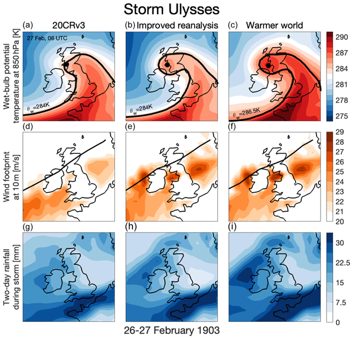

### Events in 1903

The proof-of-concept of ReBASE targeted the year 1903 when several unusual weather events occurred over the UK and Ireland. 

A study by [Hawkins et al.](https://esd.copernicus.org/articles/14/1081/2023/) considered a windstorm known as Storm Ulysses in the 20th Century Reanalysis. Three reconstructions were made - one original, one with more observations to constrain the circulation, and one with increased sea surface temperatures to represent the storm in a warmer world. In a warmer world, Ulysses drops more rain, with increased peak winds.

